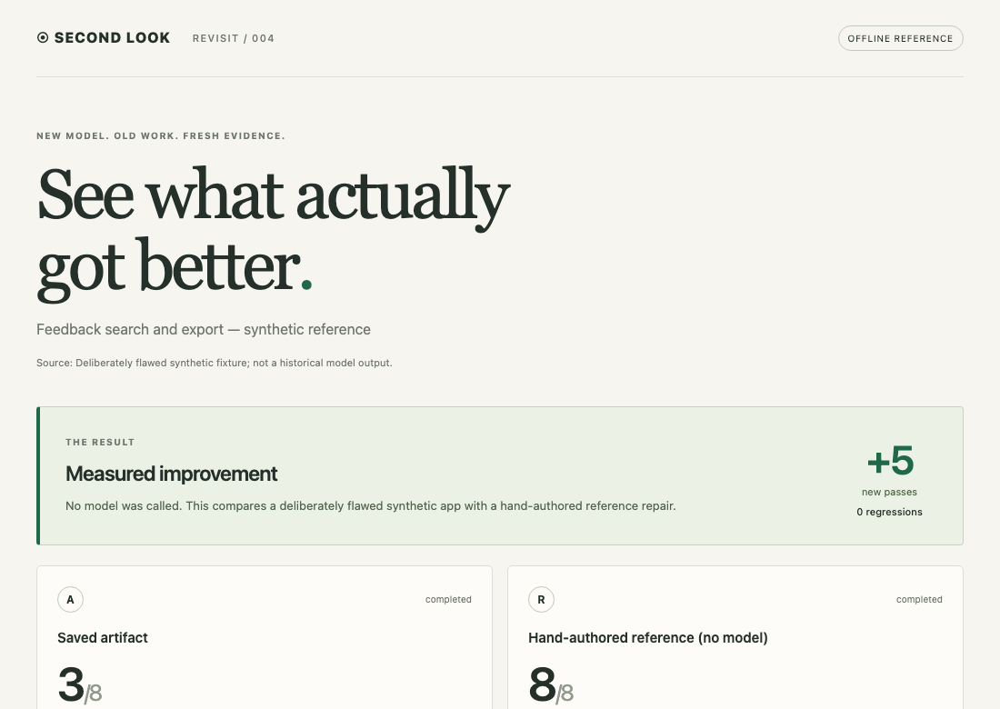

# Second Look

**New model. Old work. Show what actually got better.**

Preserve the original problem. Spend a small budget revisiting the work that
matters. Compare a patch, an intent-first revision and a fresh implementation
against the same acceptance checks—with screenshots, regressions, tokens and cost.

[Live demo](https://mandu5.github.io/secondlook/) · [Quickstart](docs/quickstart.md) · [한국어](README.ko.md) · [Releases](https://github.com/mandu5/secondlook/releases)

MIT · Python 3.11+ · macOS / Linux · **0.6 beta**



## Try it with zero model calls

```bash
python3 -m venv .venv
source .venv/bin/activate
python -m pip install 'https://github.com/mandu5/secondlook/releases/download/v0.6.0/secondlook_revisit-0.6.0-py3-none-any.whl'
python -m playwright install chromium
secondlook doctor
secondlook demo --offline --output ./first-look
```

Open `first-look/report.html` in your browser. The deliberately flawed feedback
app passes **3/8** checks; its **hand-authored reference repair** passes **8/8**.
This exercises the real browser evaluator without a model account. It is a
synthetic demonstration, not a model benchmark. On Linux, browser system libraries
may need `python -m playwright install --with-deps chromium`.

## Give your own work a second look

Simple text requirements can be captured without writing JSON:

```bash
secondlook init ./my-app --files index.html \
  --intent 'Welcome readers and retain the documentation link' \
  --expect-text 'role=heading[level=1]' 'Hello' \
  --preserve-text 'role=link[name="Documentation"]' 'Documentation' \
  --output ./capsule.json
secondlook probe ./capsule.json --output ./baseline
```

Supply **your** requirements and selectors. Intent starts as a draft; review it
and the checks before confirming. Add a separate requirements file for a clean-slate
comparison. [Complete own-project walkthrough](docs/quickstart.md#use-your-own-static-app).

| Workflow | What the candidate sees |
| --- | --- |
| **B · Patch** | Original purpose and selected existing source |
| **C · Reframe + patch** | Purpose first; existing source only after an independent brief |
| **D · Rebuild** | Independent requirements and read-only data, without old writable source |

Actual execution supports **trusted static HTML/CSS/JS**. Generate automatically
with the tool-free Claude Code CLI adapter, or import responses from the AI tool
you already use. Backends, arbitrary repositories and Python execution are not
supported. Other problem types can be preserved in the library and stay parked.

## Use your existing AI tool — no new API account

```bash
secondlook prepare ./capsule.json --mode ordinary --output ./request
# Give only request/request.md to your AI tool in a fresh conversation.
# Save its JSON response, then compare locally:
secondlook assess ./request --response ./response-a.json --label 'My chosen model' \
  --output ./comparison
```

Repeat `--response` and `--label` to compare up to four candidates. Use
`--mode rebuild` with independently confirmed requirements to omit old writable
source. The same frozen browser checks evaluate every candidate. These commands
make zero model calls; external generation may have a cost. Model labels and
optional usage records are owner-reported, and missing cost stays **Unknown**.
[Complete walkthrough and limits](docs/external-models.md).

## Revisit selectively

The [problem library](docs/problem-record.md) preserves original sources and
intent across projects. Catalog observations can prepare queues for explicitly
mapped candidates. Selection explains capability matches, declared impact/cost,
missing adapters and previous attempts.

- Free baseline checks skip already-satisfied tasks.
- Identical task/source/checks/model/workflow/harness/trial attempts are skipped.
- Source projection can reduce **bytes** of context for large single-file apps.
- Bounded runs account for failed calls too. Unknown cost stops further calls.
- Original files remain intact; adoption is manual.

These are specific waste-avoidance mechanisms, not a measured universal token
savings percentage. A catalog change does not automatically call a model.

## Share the evidence

```bash
secondlook share ./first-look/result.json --output ./shareable
# Screenshots are opt-in because they contain visible page content:
secondlook share ./first-look/result.json --output ./visual-share \
  --include-screenshots --include-intent --title 'Feedback search and export'
```

Open or host `index.html`; keep `summary.json` beside it. Default exports contain
metrics, generic check labels and recognized versioned model IDs. Source, prompts,
raw receipts, private paths and detailed errors are excluded. Explicitly included
text/images still need your review. Nothing is uploaded by this command.

## What we have measured

Two existing project artifacts reached **6/9 → 9/9** and **3/7 → 7/7** checks with
all three workflows. Rebuilding cost least on one; patching on the other.
An already-passing third artifact made zero model calls. One initial checkset
wrongly penalized a valid new DOM structure; that trial remains disclosed and
separate from the corrected, newly frozen protocol.

The two interpretable trials used **8 calls, 46,812 tokens, $0.2544832**
API-equivalent. Including the confounded trial: **12 calls, 77,088 tokens,
$0.4133206**. All used `claude-sonnet-5-5`; the old artifacts' generating models
are unknown. These are artifact/workflow comparisons, not causal model-upgrade
evidence or proof of general superiority. [Protocol and all costs](docs/real-cases-v0.4.md).

Promptfoo, LangSmith, Spec Kit and other projects cover important parts of this
space. Second Look explores the connection between preserved intent, revisit
selection and implementation alternatives. [Prior art](docs/research-v0.3.md) ·
[Updated research and v0.6 decisions](docs/research-v0.6.md).

## Contribute

```bash
git clone https://github.com/mandu5/secondlook.git
cd secondlook
python3 -m venv .venv && source .venv/bin/activate
python -m pip install -e '.[dev]'
python -m playwright install chromium
python -m pytest -q
```

[Contributing](CONTRIBUTING.md) · [Security & data boundaries](SECURITY.md) ·
[CLI reference](docs/cli-reference.md) · [Clean-slate protocol](docs/clean-slate.md) ·
[Changelog](CHANGELOG.md) · [Roadmap](docs/roadmap.md)

Live-run costs are CLI-reported API-equivalent estimates, not subscription invoices.
Imported costs and model labels are owner-reported, not provider-verified.
Provider budget stops can overshoot by an in-flight response. Local browser
network isolation is not an OS sandbox for hostile code. Keep private reports
private. No automatic adoption, telemetry or background model runs.
